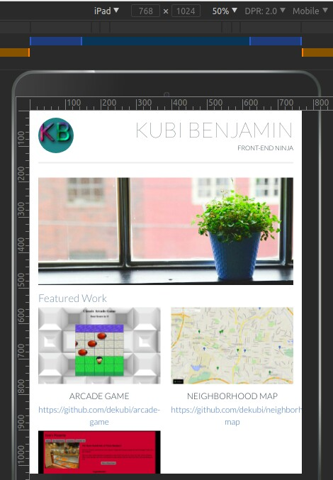
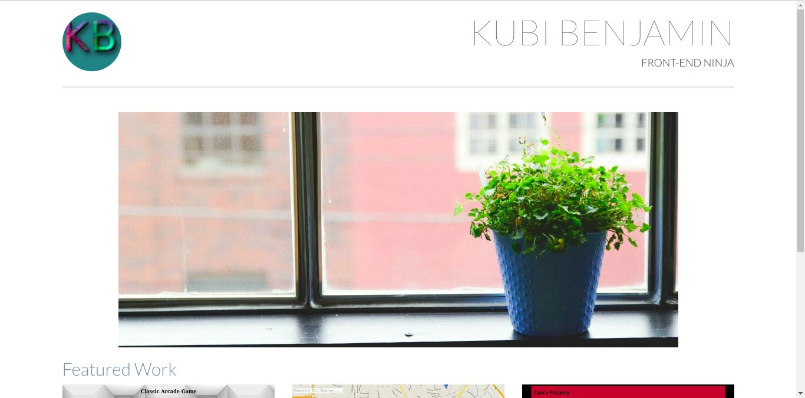
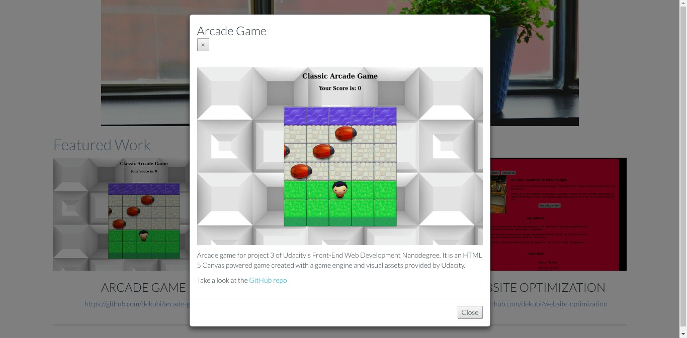

# FEND-Build-A-Portfolio

Udacity Front-End Web Developer Nanodegree Project 1: Build a Portfolio Site
For this project, I'll be building a portfolio website.

## Project Overwiew

 I was provided a design mockup as a PDF-file, and must replicate that design in HTML and CSS which I can further tweak to make customizations to the design to personalize it and make it my own. I develop a responsive website that display images, descriptions and links to each of the portfolio projects I will complete through the course of my Nanodegree program.

### Dependencies

This project uses a number of open source work:

* [Font Awesome](https://fontawesome.io) - The iconic font and CSS toolkit.
* [Twitter Bootstrap](https://getbootstrap.com) - An open-source front-end web framework for designing websites and web applications.
* [JQuery](https://jquery.com) - JavaScript library designed to simplify the client-side scripting of HTML.
* [Normalize.css](https://necolas.github.io/normalize.css) - A modern, HTML5-ready alternative to CSS resets.

### Why This Project

The first thing potential employers look for isn’t which school you attended or what your GPA was; they want to see what you’ve built! You need a professional portfolio to show off your skills.

In this project I built a great looking portfolio where I can show off images, descriptions, links and modals to all of my projects. I did whiles writing code that conforms to the [Udacity Style Guide](http://udacity.github.io/frontend-nanodegree-styleguide).

### What did I learn

I learnt how HTML is used to define the content of a web page and start to think of every web page as a number of boxes on the screen. I then learnt how to position those boxes and make them beautiful using CSS.

I accomplish this while conforming to the [Udacity Style Guide](http://udacity.github.io/frontend-nanodegree-styleguide) which is an important constraint once I step into any existing development position.

### Why is this important to my career'?'

* Without a portfolio, recruiters won’t even look at your resume much less interview you.
* At their very foundation, web applications are just content delivery mechanisms; HTML defines how that language is structured.
* Reading poorly designed content is never an enjoyable experience; CSS empowers you to create beautiful content regardless of your user’s device.

### Todos

- _**Tweaking and Customizing of UI**_
- _**Adding more future projects**_

### Screenshots

